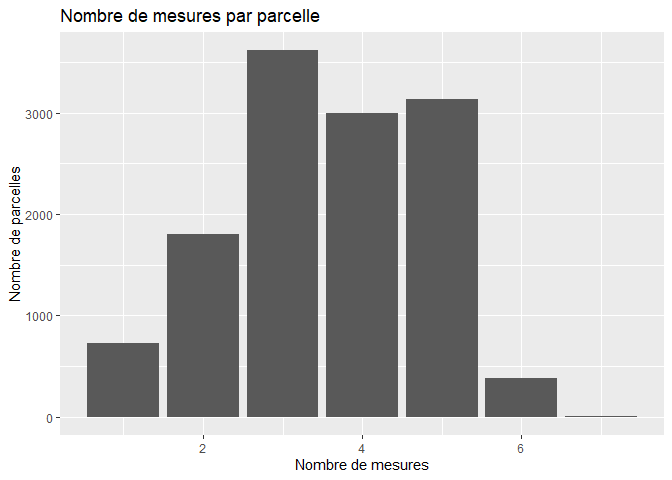
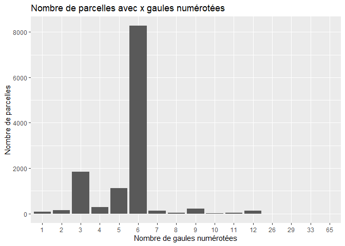
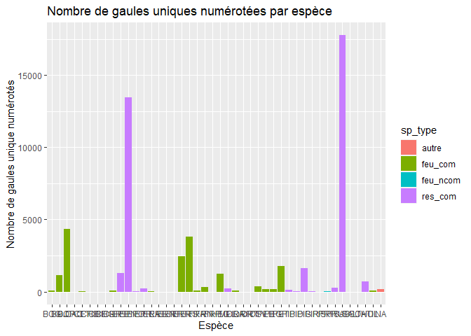
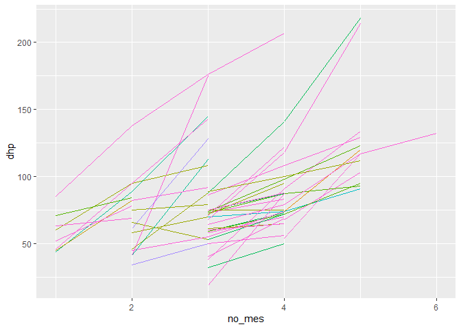
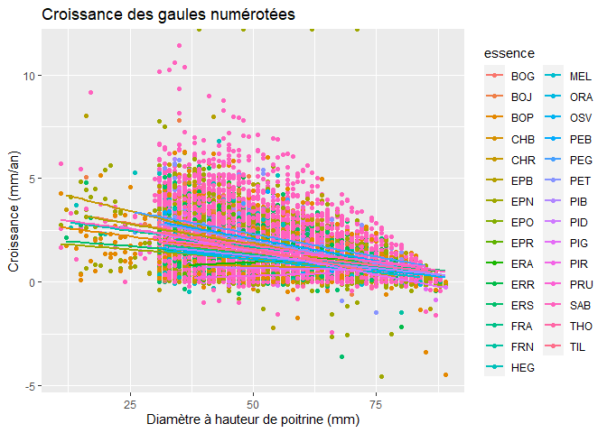
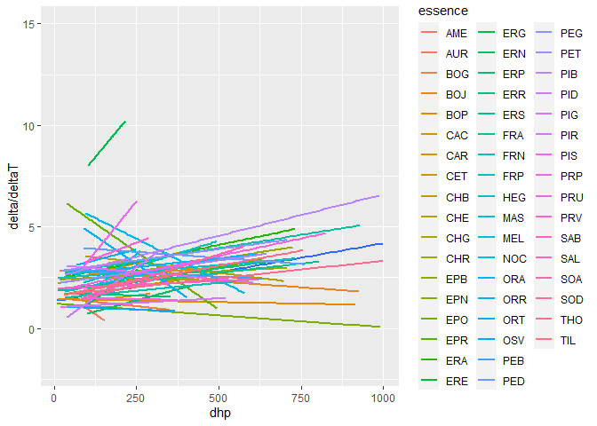

Exploration des données
================
Clémentine
02/02/2023

## 1. Les données

### 1.1. Les espèces

``` r
head(tree_sp)
```

    ##                                   nom_fr               nom_latin code
    ## 1              Bouleau à papier (blanc)       Betula papyrifera   BOP
    ## 2 Bouleau gris (à feuilles de peuplier)      Betula populifolia   BOG
    ## 3                         Bouleau jaune   Betula alleghaniensis   BOJ
    ## 4          Caryer à fruits doux (ovale)             Carya ovata   CAF
    ## 5                     Caryer cordiforme       Carya cordiformis   CAC
    ## 6                       Cerisier tardif         Prunus serotina   CET
    ##         zone      type commerciale
    ## 1  tempérée   Feuillus        TRUE
    ## 2  tempérée   Feuillus        TRUE
    ## 3  tempérée   Feuillus        TRUE
    ## 4  tempérée   Feuillus        TRUE
    ## 5  tempérée   Feuillus        TRUE
    ## 6  tempérée   Feuillus        TRUE

Légendes :

`*` Espèces exotiques envahissante

\*\* Espèces méridionales dont l’aire de répartition a atteint le Québec

\*\*\* Espèce vulnérable indigène

### 1.4. Les données des placettes-échantillons

data : sap_xy (données sur les gaules)

colonnes :

- “id_pe” : identifiant de la parcelle
- “no_mes” : numéro de la mesure
- “id_pe_mes” : identifiant de la parcelle et de la mesure
- “essence” : essence de l’arbre
- “cl_dhp” : classe des diamètres à hauteur de poitrine
- “nb_tige” : nombre de tiges
- “tige_ha” : nombre de tige à l’hectare
- “st_ha” : surface terrière à l’hectare
- “geom” : coordonnées géographiques

data : pep_mes_xy (données sur les placettes, dates et coordonnées)

colonnes :

- “id_pe” : identifiant de la parcelle
- “no_mes” : numéro de la mesure
- “id_pe_mes” : identifiant de la parcelle et de la mesure
- “version” : version de type de la mesure
- “dimension” : dimension de la placette
- “no_prj_mes” : numéro du projet de la mesure
- “date_sond” : date de la mesure
- “statut_mes” : statut de la placette lors de la mesure
- “ver_pep” : version des données de la placette
- “geom” : coordonnées de la placette

data : tree_mes_xy (données sur les arbres)

colonnes :

- “id_pe” : identifiant de la parcelle
- “no_mes” : numéro de la mesure
- “id_pe_mes” : identifiant de la parcelle et de la mesure
- “no_arbre” : numéro de l’arbre
- “id_arbre” : identifiant de placette échantillon et numero de l’arbre
- “id_arb_mes” : identifiant de placette de l’arbre et de la mesure
- “etat” : état de l’arbre
- “essence” : essence de l’arbre
- “in_ess_nc” : indicateur d’essence non conforme
- “dhp” : diamètre à hauteur de poitrine
- “dhp_nc” : indicateur de diamètre non conforme
- “in_1410” : indicateur de présence dans la placette de 14.10 m de
  rayon
- “caus_defol” : cause de la défoliation
- “defol_min” : Pourcentage de défoliation minimal de l’essence
  résineuse
- “defol_max” : Pourcentage de défoliation maximal de l’essence
  résineuse
- “cl_qual” : classe de qualité
- “defautbas” : défaut au bas de la tige (0 à 5m)
- “defauthaut” : défaut haut de la tige (au dessus de 5m)
- “defaut” : défaut de la tige
- “hauteurdef” : hauteur du défaut
- “dic” : Défaut indicateur de carie établi selon le “Guide des défauts
  externes et des indices de la carie dans les arbres”
- “in_dic_obs” : indicateur d’un défaut indicateur de carie observé
- “hauteurdic” : Hauteur du défaut indicateur de carie (m)
- “prio_recol” : priorité de la récolte
- “ensoleil” : classe d’’ensoleillement
- “etage_arb” : étage de l’arbre
- “stade_degr” : stade de dégradation
- “tige_ha” : nombre de tiges à l’hectare
- “st_tige” : surface terrière de la tige (cm2)
- “st_ha” : surface terrière à l’hectare (m2/ha)
- “haut_esti” : hauteur estimée de la tige (dm)
- “vmb_tige” : volume moyen brut de la tige (m3)
- “vmb_ha” : volume moyen brut à l’hectare (m3/ha)
- “geom” : coordonnées de la placette

## 2. Mise en forme et graphes d’exploration rapide des données

#### Merge entre les données sur les gaules et les données sur les placettes

#### Nombre de mesure par parcelle

``` r
# nombre de mesures par parcelle
ggplot(data_sap %>%
            group_by(id_pe) %>%
            summarise(n_mes = n_distinct(no_mes))) +
    geom_bar(aes(x = n_mes)) +
    labs(title = "Nombre de mesures par parcelle",
        x = "Nombre de mesures",
        y = "Nombre de parcelles")
```

<!-- -->

## 3. Etude sur les gaules numérotées

### 3.1 Récupération des gaules numérotées

Dans chaque parcelle il est recommandé de récupérer 3 gaules de chaque
espèce commerciale, qui représentent la régénération en cours. Pour les
récupérer je prends les arbres dont le diamètre à hauteur de poitrine
est inférieur à 90mm. Dans le tableau gaules_num.

Il y a beaucoup de dhp = NA, je ne sais pas pourquoi. (à regarder de
plus près) Aussi sans placettes

Q_mh : pourquoi y-a-t-il des lignes sans placette ?

``` r
# récupérer les arbres en dessous de dhp < 90mm dans tree_mes
# filter les placettes na
gaules_num <- tree_mes_xy[tree_mes_xy$dhp < 90, ] %>%
                        filter(! is.na(id_pe))
```

On a 67 734 gaules numérotées dans tree_mes

### 3.2 Observation des gaules numérotés (où sont-elles, quelles espèces, etc.)

``` r
# nombre de parcelles avex x gaules numérotées
# ! pas forcéments différentes
gaules_num <- gaules_num
ggplot(data.frame(table(table(gaules_num$id_pe)))) +
    geom_bar(aes(x = Var1, y = Freq), stat = "identity") +
    labs(title = "Nombre de parcelles avec x gaules numérotées",
        x = "Nombre de gaules numérotées",
        y = "Nombre de parcelles")
```

<!-- -->

``` r
# nombre de gaules uniques numérotées par espèce
esp_gaule_temoin <- gaules_num %>%
                        data.frame() %>%
                        ungroup() %>%
                        group_by(essence) %>%
                        summarize(nb_arbre = length(unique(id_arbre))) %>%
mutate(sp_type =
        ifelse(essence %in%
            tree_sp[which(tree_sp$commerciale & tree_sp$type == " Resineux"),
            "code"], "res_com",
        ifelse(essence %in%
            tree_sp[which(tree_sp$commerciale & tree_sp$type == " Feuillus"),
                "code"], "feu_com",
        ifelse(essence %in%
            tree_sp[which(!tree_sp$commerciale & tree_sp$type == " Feuillus"),
                "code"], "feu_ncom",
        "autre"))))

ggplot(esp_gaule_temoin) +
    geom_bar(aes(x = essence, y = nb_arbre, fill = sp_type),
        stat = "identity") +
    labs(title = "Nombre de gaules uniques numérotées par espèce",
        x = "Espèce",
        y = "Nombre de gaules unique numérotés")
```

<!-- -->

``` r
# nombre retrouvé plusieurs fois à l'état de gaule
table(table(gaules_num$id_arbre))
```

    ## 
    ##     1     2     3     4 
    ## 36989 14619   261   181

Récupération des données sur les gaules numérotées au stade de gaule et
au delà du recrutement

``` r
# liste des id_arbre des gaules numérotées
id_arbre_gaule <- unique(gaules_num$id_arbre)
# sample de 100 gaules
id_arbre_gaule_sample <- sample(id_arbre_gaule, 100)
# récupérer les données de ces gaules
tree_mes_gaule_sample <- tree_mes_xy %>%
                            filter(id_arbre %in% id_arbre_gaule_sample)
# observer leur état dans le temps
# pour chaque numéro de mesures  : recuperer l'état de la gaule
etat_gaule <- tree_mes_gaule_sample %>%
                group_by(id_arbre, no_mes, essence) %>%
                summarize(etat = etat, dhp = dhp)
```

    ## `summarise()` has grouped output by 'id_arbre', 'no_mes'. You can override
    ## using the `.groups` argument.

``` r
# Plot
ggplot(etat_gaule) +
    geom_line(aes(x = no_mes, y = dhp, group = id_arbre, color = essence)) +
    guides(color = FALSE)
```

    ## Warning: The `<scale>` argument of `guides()` cannot be `FALSE`. Use "none" instead as
    ## of ggplot2 3.3.4.

    ## Warning: Removed 48 rows containing missing values (`geom_line()`).

<!-- -->

Q_mh : est ce que GA c est gaule mais une erreur ? et ça devrait être NA
? Je n en ai pas l impression ressemble plus à GM

## 4. Observation de la croissance

### 4.1 Calcul de la croissance pour les gaules numérotées

``` r
# Ajout des dates de mesures aux données des gaules numérotées
grouped_data <- merge(data.frame(gaules_num),
                      data.frame(pep_mes_xy %>%
                        select(id_pe_mes, date_sond))) %>%
                        group_by(id_arbre)
# Calculate the difference between consecutive measures for
# each individual and species
deltas <- grouped_data %>%
    mutate(mesure_suivante = lead(dhp),
         delta = mesure_suivante - dhp,
         date_suivante = lead(date_sond),
         deltaT = as.numeric(difftime(date_suivante,
            date_sond, units = "days") / 365.25))
# Select the columns with the information we need
result <- deltas %>%
  select(essence, dhp, mesure_suivante, delta, deltaT)
```

    ## Adding missing grouping variables: `id_arbre`

``` r
# Remove the rows with missing values
# (to keep the values where there are two consecutive measures)
result <- na.omit(result)
```

``` r
# Plot croissance : delta/deltaT en fonction de dhp
ggplot(result) +
    geom_point(aes(x = dhp, y = delta / deltaT, color = essence)) +
    geom_smooth(aes(x = dhp, y = delta / deltaT, color = essence),
        method = "lm", se = FALSE) +
    labs(title = "Croissance des gaules numérotées",
        x = "Diamètre à hauteur de poitrine (mm)",
        y = "Croissance (mm/an)")
```

    ## `geom_smooth()` using formula = 'y ~ x'

    ## Warning: Removed 4 rows containing non-finite values (`stat_smooth()`).

<!-- -->

Model linéarire de croissance extrèmement simple :

- Lire le document sur la croissance des arbres, diamètre et relation
  aux autres fonctions
- Verifier dans l’inventaire comment sont numéroter exactement les
  gaules (en particulier parce que j’ai l’impression qu’elles ont des
  tailles discrètes sur le graphe)
- Peut-on concidérer une croissance linéaire entre 0 et 90 mm ?
- D’après le graphe diminution de la croissance avec le dhp
- Concidérer une ordonée à l’origine ? (sachant que de toute façon on a
  pas de diamètre à 0)

``` r
# model linéaire extrèmement simple :
# croissance linéaire entre 0 et 90 mm
# ordonnée à l'origine nulle
# dépend seulement de deltaT (temps)
model_c <- lm(delta ~ 0 + deltaT, data = result)
summary(model_c)
```

    ## 
    ## Call:
    ## lm(formula = delta ~ 0 + deltaT, data = result)
    ## 
    ## Residuals:
    ##     Min      1Q  Median      3Q     Max 
    ## -63.291  -7.276  -1.801   6.918  51.986 
    ## 
    ## Coefficients:
    ##        Estimate Std. Error t value Pr(>|t|)    
    ## deltaT 1.226820   0.008063   152.2   <2e-16 ***
    ## ---
    ## Signif. codes:  0 '***' 0.001 '**' 0.01 '*' 0.05 '.' 0.1 ' ' 1
    ## 
    ## Residual standard error: 11.29 on 15675 degrees of freedom
    ## Multiple R-squared:  0.5963, Adjusted R-squared:  0.5963 
    ## F-statistic: 2.315e+04 on 1 and 15675 DF,  p-value: < 2.2e-16

``` r
# Avec un effet de l'essence :
model_c_ess <- lm(delta ~ 0 + deltaT + essence, data = result)
summary(model_c_ess)
```

    ## 
    ## Call:
    ## lm(formula = delta ~ 0 + deltaT + essence, data = result)
    ## 
    ## Residuals:
    ##     Min      1Q  Median      3Q     Max 
    ## -61.247  -7.801  -2.319   5.699  57.753 
    ## 
    ## Coefficients:
    ##            Estimate Std. Error t value Pr(>|t|)    
    ## deltaT      0.76969    0.02752  27.969  < 2e-16 ***
    ## essenceBOG 14.78803    3.81174   3.880 0.000105 ***
    ## essenceBOJ  8.66013    0.70716  12.246  < 2e-16 ***
    ## essenceBOP  4.77113    0.39021  12.227  < 2e-16 ***
    ## essenceCHB -0.59258    6.19464  -0.096 0.923792    
    ## essenceCHR 10.74067    2.04419   5.254 1.51e-07 ***
    ## essenceEPB  7.52563    0.67302  11.182  < 2e-16 ***
    ## essenceEPN  2.43538    0.37062   6.571 5.15e-11 ***
    ## essenceEPO 25.64225   10.72909   2.390 0.016861 *  
    ## essenceEPR  5.16740    1.68314   3.070 0.002144 ** 
    ## essenceERA  2.39973    4.07599   0.589 0.556038    
    ## essenceERR  8.33974    0.49634  16.803  < 2e-16 ***
    ## essenceERS  4.09957    0.40912  10.020  < 2e-16 ***
    ## essenceFRA  8.84260    2.98878   2.959 0.003095 ** 
    ## essenceFRN  3.93731    1.18461   3.324 0.000890 ***
    ## essenceHEG  9.32544    0.67876  13.739  < 2e-16 ***
    ## essenceMEL  1.98832    1.44217   1.379 0.168005    
    ## essenceORA  5.54658    3.59004   1.545 0.122369    
    ## essenceOSV  2.28394    1.04495   2.186 0.028853 *  
    ## essencePEB 12.86694    2.54660   5.053 4.41e-07 ***
    ## essencePEG 14.59627    2.35548   6.197 5.91e-10 ***
    ## essencePET 11.94178    0.75557  15.805  < 2e-16 ***
    ## essencePIB  3.40635    1.69438   2.010 0.044408 *  
    ## essencePID -2.66956    6.21943  -0.429 0.667762    
    ## essencePIG  4.90780    0.77247   6.353 2.16e-10 ***
    ## essencePIR -5.48840    5.37463  -1.021 0.307191    
    ## essencePRU  5.86268    1.29447   4.529 5.97e-06 ***
    ## essenceSAB  8.12552    0.30544  26.603  < 2e-16 ***
    ## essenceTHO  4.23574    0.71757   5.903 3.65e-09 ***
    ## essenceTIL 11.67436    2.69839   4.326 1.52e-05 ***
    ## ---
    ## Signif. codes:  0 '***' 0.001 '**' 0.01 '*' 0.05 '.' 0.1 ' ' 1
    ## 
    ## Residual standard error: 10.73 on 15646 degrees of freedom
    ## Multiple R-squared:  0.6361, Adjusted R-squared:  0.6354 
    ## F-statistic: 911.5 on 30 and 15646 DF,  p-value: < 2.2e-16

``` r
anova(model_c, model_c_ess)
```

    ## Analysis of Variance Table
    ## 
    ## Model 1: delta ~ 0 + deltaT
    ## Model 2: delta ~ 0 + deltaT + essence
    ##   Res.Df     RSS Df Sum of Sq      F    Pr(>F)    
    ## 1  15675 1996966                                  
    ## 2  15646 1800255 29    196711 58.952 < 2.2e-16 ***
    ## ---
    ## Signif. codes:  0 '***' 0.001 '**' 0.01 '*' 0.05 '.' 0.1 ' ' 1

``` r
# interaction entre deltaT et essence
model_c_ess_int <-
    lm(delta ~ 0 + deltaT + essence + deltaT:essence, data = result)
summary(model_c_ess_int)
```

    ## 
    ## Call:
    ## lm(formula = delta ~ 0 + deltaT + essence + deltaT:essence, data = result)
    ## 
    ## Residuals:
    ##     Min      1Q  Median      3Q     Max 
    ## -61.850  -7.686  -2.405   5.673  58.703 
    ## 
    ## Coefficients: (3 not defined because of singularities)
    ##                   Estimate Std. Error t value Pr(>|t|)    
    ## deltaT             -1.3555     2.1243  -0.638 0.523444    
    ## essenceBOG         44.3642    29.8066   1.488 0.136665    
    ## essenceBOJ          3.7424     2.8595   1.309 0.190640    
    ## essenceBOP          2.6672     0.9320   2.862 0.004218 ** 
    ## essenceCHB         10.2470    12.4765   0.821 0.411483    
    ## essenceCHR          2.6756    11.4023   0.235 0.814481    
    ## essenceEPB          4.5683     2.0188   2.263 0.023655 *  
    ## essenceEPN          4.4771     0.5744   7.794 6.89e-15 ***
    ## essenceEPO         43.1962    20.5590   2.101 0.035649 *  
    ## essenceEPR          5.0375    10.1611   0.496 0.620069    
    ## essenceERA          5.0977    18.2913   0.279 0.780481    
    ## essenceERR          4.0326     1.8258   2.209 0.027207 *  
    ## essenceERS          3.3100     1.4415   2.296 0.021672 *  
    ## essenceFRA        -10.2101    18.1855  -0.561 0.574507    
    ## essenceFRN         -1.6582     5.6299  -0.295 0.768349    
    ## essenceHEG          6.7966     2.8608   2.376 0.017527 *  
    ## essenceMEL         16.9072     8.3519   2.024 0.042952 *  
    ## essenceORA         -9.8691    19.4744  -0.507 0.612322    
    ## essenceOSV          3.4305     6.4112   0.535 0.592604    
    ## essencePEB         34.8893    12.2856   2.840 0.004519 ** 
    ## essencePEG         16.1350    16.3365   0.988 0.323332    
    ## essencePET          4.1356     2.8044   1.475 0.140318    
    ## essencePIB         16.5418    10.4280   1.586 0.112696    
    ## essencePID         41.5151    44.5988   0.931 0.351943    
    ## essencePIG         10.0554     3.0344   3.314 0.000923 ***
    ## essencePIR          3.7714    50.2314   0.075 0.940151    
    ## essencePRU         10.4349     3.9384   2.650 0.008069 ** 
    ## essenceSAB          7.6598     0.4557  16.810  < 2e-16 ***
    ## essenceTHO          6.6466     2.9447   2.257 0.024012 *  
    ## essenceTIL        -32.2180    17.1284  -1.881 0.059995 .  
    ## deltaT:essenceBOJ   2.6284     2.1434   1.226 0.220112    
    ## deltaT:essenceBOP   2.3371     2.1262   1.099 0.271709    
    ## deltaT:essenceCHB       NA         NA      NA       NA    
    ## deltaT:essenceCHR   2.9678     2.4264   1.223 0.221296    
    ## deltaT:essenceEPB   2.4370     2.1340   1.142 0.253483    
    ## deltaT:essenceEPN   1.9584     2.1248   0.922 0.356704    
    ## deltaT:essenceEPO       NA         NA      NA       NA    
    ## deltaT:essenceEPR   2.1369     2.3083   0.926 0.354593    
    ## deltaT:essenceERA   1.9483     2.4248   0.803 0.421704    
    ## deltaT:essenceERR   2.5512     2.1316   1.197 0.231385    
    ## deltaT:essenceERS   2.2022     2.1288   1.034 0.300925    
    ## deltaT:essenceFRA   3.9574     2.7368   1.446 0.148188    
    ## deltaT:essenceFRN   2.6671     2.1904   1.218 0.223386    
    ## deltaT:essenceHEG   2.3679     2.1412   1.106 0.268808    
    ## deltaT:essenceMEL   0.8002     2.2466   0.356 0.721705    
    ## deltaT:essenceORA   3.4422     2.6811   1.284 0.199196    
    ## deltaT:essenceOSV   2.0089     2.2192   0.905 0.365351    
    ## deltaT:essencePEB   0.1361     2.3858   0.057 0.954504    
    ## deltaT:essencePEG   1.9641     2.7157   0.723 0.469529    
    ## deltaT:essencePET   2.8787     2.1405   1.345 0.178674    
    ## deltaT:essencePIB   0.7023     2.3991   0.293 0.769719    
    ## deltaT:essencePID       NA         NA      NA       NA    
    ## deltaT:essencePIG   1.7467     2.1355   0.818 0.413396    
    ## deltaT:essencePIR   1.3933     4.4828   0.311 0.755952    
    ## deltaT:essencePRU   1.6734     2.1561   0.776 0.437685    
    ## deltaT:essenceSAB   2.1732     2.1248   1.023 0.306434    
    ## deltaT:essenceTHO   1.8658     2.1466   0.869 0.384764    
    ## deltaT:essenceTIL   6.1527     2.6311   2.338 0.019376 *  
    ## ---
    ## Signif. codes:  0 '***' 0.001 '**' 0.01 '*' 0.05 '.' 0.1 ' ' 1
    ## 
    ## Residual standard error: 10.71 on 15621 degrees of freedom
    ## Multiple R-squared:  0.6376, Adjusted R-squared:  0.6363 
    ## F-statistic: 499.7 on 55 and 15621 DF,  p-value: < 2.2e-16

``` r
anova(model_c_ess, model_c_ess_int)
```

    ## Analysis of Variance Table
    ## 
    ## Model 1: delta ~ 0 + deltaT + essence
    ## Model 2: delta ~ 0 + deltaT + essence + deltaT:essence
    ##   Res.Df     RSS Df Sum of Sq      F    Pr(>F)    
    ## 1  15646 1800255                                  
    ## 2  15621 1792706 25      7549 2.6312 1.646e-05 ***
    ## ---
    ## Signif. codes:  0 '***' 0.001 '**' 0.01 '*' 0.05 '.' 0.1 ' ' 1

``` r
# limite à faire individuellement par espèce
```

On trouve une croissance de 1.23 mm par an avec le model sans
distinction d’espèce

Note de lecture :

Le point d’inflexion considéré correspond au changement de pente entre
la crise de 0 à 5 ans et la croissance libre. Il peut en réalité avoir
lieu à 4, 5, 6, 7 ans selon les cas. La modélisation envisagée (qui sert
aussi pour EcoAF) est très simple : croissance linéaire entre 0
(plantation) et 5 ans, puis aussi linéaire après 5 ans, et enfin un
arrêt à 65-70 cm de diamètre (ou moins selon les espèces). En
agroforesterie dynamique, la croissance est libre mais on ne laisse pas
les arbres devenir trop grands.
(<https://hal.inrae.fr/hal-03573461/document>)

### 4.2 Calcul de la croissance pour les arbres numérotées

``` r
# Group by individual id and species
grouped_data <- tree_mes_xy
grouped_data <- merge(data.frame(grouped_data),
                      data.frame(pep_mes_xy %>%
                        select(id_pe_mes, date_sond))) %>%
                        group_by(id_arbre)
# Calculate the difference between consecutive measures for
# each individual and species
deltas <- grouped_data %>%
    mutate(mesure_suivante = lead(dhp),
         delta = mesure_suivante - dhp,
         date_suivante = lead(date_sond),
         deltaT = as.numeric(difftime(date_suivante,
            date_sond, units = "days") / 365.25))
# Select the columns with the information you want
result_full <- deltas %>%
  select(essence, dhp, mesure_suivante, delta, deltaT)
```

    ## Adding missing grouping variables: `id_arbre`

``` r
result_full <- na.omit(result_full)

# sample 1000 ligne de result_full
# for sample : sample <- result_full[sample(nrow(result_full), 935183),]
```

``` r
# Plot croissance : delta/deltaT en fonction de dhp
ggplot(result_full) +
    #geom_point(aes(x = dhp, y = delta / deltaT, color = essence)) +
    geom_smooth(aes(x = dhp, y = delta / deltaT), method = "lm") +
    # faire un geom_smooth pour chaque espèce
    geom_smooth(aes(x = dhp, y = delta / deltaT, color = essence),
        method = "lm", se = FALSE) +
        ylim(-2, 15)
```

    ## `geom_smooth()` using formula = 'y ~ x'

    ## Warning: Removed 2403 rows containing non-finite values (`stat_smooth()`).

    ## `geom_smooth()` using formula = 'y ~ x'

    ## Warning: Removed 2403 rows containing non-finite values (`stat_smooth()`).

<!-- -->

Croissance linéaire ? ça allègerait aussi les caluculs pour la suite

Croissance annuelle entre 0 et 10 mm

Quelques valeus négatives (erreurs de mesures)

Il y a des arbres qui ont très peu de mesures je pense (en tout cas
proportionnelement aux autres)

## 5. Etude au niveau de la population (sap)

les données sont sap_xy, pour rappel

data : sap_xy (données sur les gaules)

colonnes :

- “id_pe” : identifiant de la parcelle
- “no_mes” : numéro de la mesure
- “id_pe_mes” : identifiant de la parcelle et de la mesure
- “essence” : essence de l’arbre
- “cl_dhp” : classe des diamètres à hauteur de poitrine
- “nb_tige” : nombre de tiges
- “tige_ha” : nombre de tige à l’hectare
- “st_ha” : surface terrière à l’hectare
- “geom” : coordonnées géographiques

Il faut que j’étudie le northern shift des espèces tempérées Comment
étudier le déplacement géographique des différentes espèces ?

## 6. Distribution spatiale de la diversité

``` r
#a <- tree_mes_xy %>%
#    filter (no_mes == 1) %>%
#    group_by(id_pe, essence) %>%
#    summarize(diversity = n()) %>%
#    mapview()
```

``` r
#b <- a %>%
#  ungroup() %>%
#  group_by(id_pe) %>%
#  summarise(div=n())
```

``` r
#b %>% mapview(zcol="div")
```

To do : regarder l’évolutioin des gaules numérotées dans le temps (morte
“GM”, ou recrutée “24”) grâce à leur tag et la variable état comparer
ces résultats avec les données de la base sap (dénombrement des gaules)
separer les espèces tempérée et boréale

Plus long terme : utiliser les données de peuplement, de climat, de
perturbation, de sol faire des modèles de prédiction
